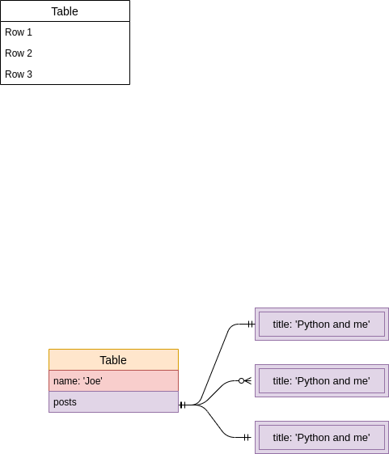

## Why mongo

- Mongo is a database `from` browser `and` mobile App
  - We use `mongoose` to work with mongo in Node.
    - `ORM` object relational mapper.

## Where mongo fits

- There is usually a server between the mobile and db

## Fundamental of Mongodb

- Database #1 . Allows us to create multiple databases on a single instance.
  - Collection

### Core of Mongoose/Mongo

The four operation **CRUD**.

1. Create.
2. Update.
3. Destory/Delete.
4. Read

## Mongo Connection.

```
const mongoose = require('mongoose');

mongoose.connect('mongodb://localhost/users_test');

mongoose.connection
  .once('open', () => console.log('Good to go'))
  .on('error', (error) => {
    console.warn('Warning', error);
  });
```

> Event Handlers.
> **once()** => watch for mongoose to emit an even 'open'
> **on()** => watch for mongoose to emit and error event.

## Create a Schema and a model

- Properties in schema are not madatory(unless indicated.)

```Javascript
const mongoose = require('mongoose');

const { Schema } = mongoose.Schema;

const UserSchema = new Schema({ name: String });

const User = mongoose.model('user', UserSchema);

modules.exports = user;
```

## Mocha : Testing Framework

- Using mocha to test Crud functtions.

### Create

### Find

- To Find records, from mongo db. There a number of ways to do
  - model.findOne({\_id: joe.\_id})

### Delete

- **Remove is deplicated.**
- You can use either **model class** or **model instance**
- **Model class**
  - remove : remove alot with a criteria.
  - findOneAndRemove
  - findByIdAndRemove
- **Model instance**
  - remove

### Update

- **Model Class**
  - update
  - findOneAndUpdate
  - findByIdAndUpdate
- **Model Instance**

  - Update
  - 'set' and 'save'

#### Update operator.

### Mongoose Validation.

### Embedding Relationship.



### Our server.

- Virtual types: properties on a model that don't get persisted to the database.
- Use repl to test virtual types.

```
UserSchema.virtual('postCount').get(function(){
return this.posts.length;
};

```

We don't use fat arrow functions => since we want to have access to the **this** keyword.

```

### challages of NestedDocuments.
```

1. Fetching specific number of posts is challaging.
2. When you nest Documents inside posts. - It not easy to get the list of nested documents.

### Using Separate database.

- We don't have single operation join with mongodb. (we have to touch the database alot of times.)

### querys.

```Js
User.findOne({name: 'edwin'}).populate('blogPosts').then()

### Loading deeply nested Collection.
```

### Middleware : pre and post Hooks.

### Dealing with cylic : delete
